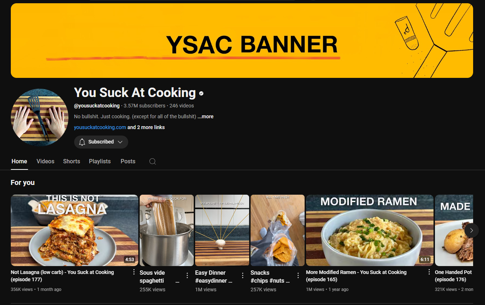

# Moodboarding

Inspirations go here:

- Structure for cards
    - Products listed 
    - Clear focus on social media/consumer interaction 
    - Branding strong using colour palette 
        - Yellow colour in Sorted Logos
        - SORTED FOOD branding text typeset

- Humour!
    - Banner says "Banner"
    - All thumbnails make clear there is humour with recipes
- Colour palette
    - Bright yellows and strong consistency with wood chopping board