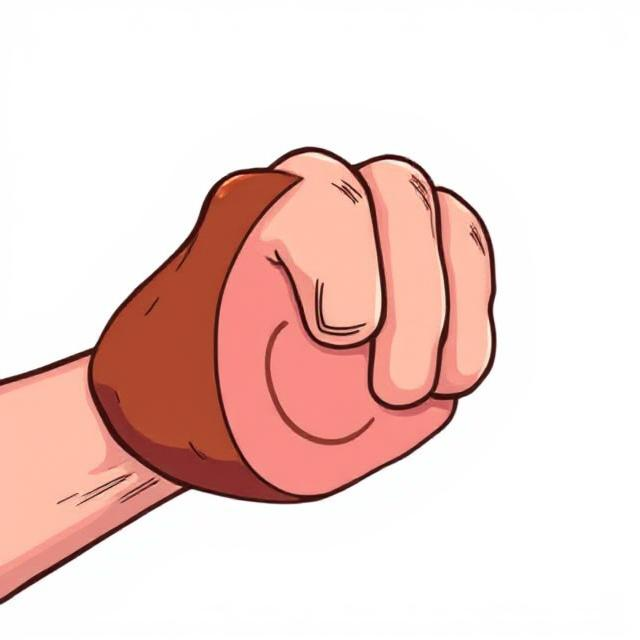
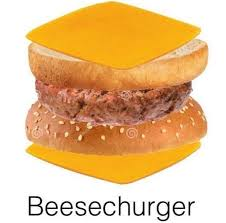
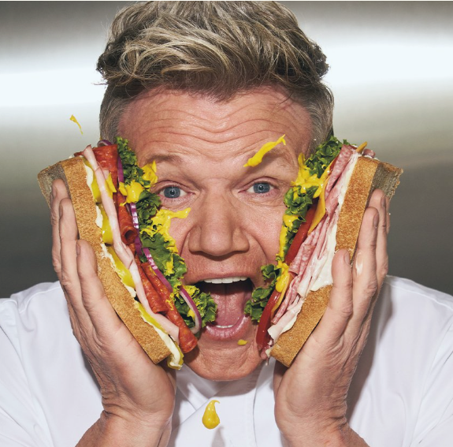
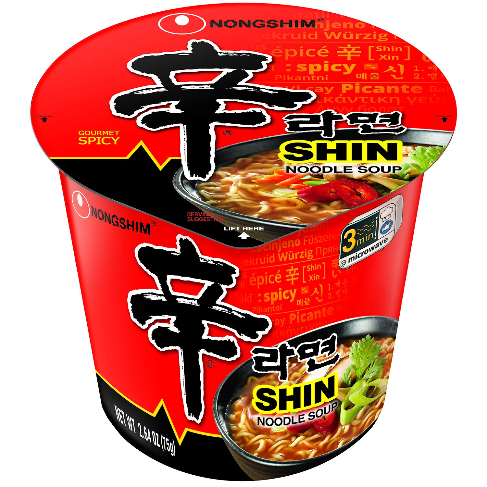

# Test Menu Website

## Website about lunch options!

Was initially confused at how I was supposed to go about most of this, *however* I was able to work more on it after first lesson on intro to HTML.
Content of the website not important, structure is the key, so I have made mine memeable![^note]

## Adding first item 
Easy! image and text easy to add in, formatting not hugely an issue until adding more.
How do I add more?~!

### Recipes for lols:
These are the recipes I will use, humour is the best for struggling to learn something, keeps the energy *high*
<!--  This image was huge so I changed to using html here-->
<!--decided to make a table to illustrate more clearly, will this actually make a table? Lets find out!-->
|  Recipe     |  Image     |
|:----------  |:----------:|
|Beesechurger ||
|Hamfist  ||
| Idiot Sandwich | |
| Water | |
| Instant Ramen | |

### Link to blog:
- Sub in Democracy manifest wiki (succulent chinese meal)
[Democracy Manifest][demolink]

#### Post Sat lesson (first class on HTML) had much more confidence to get into this website!
- 5x boxes created for "recipes"
- trial and errored my way through CSS Flexbox method, the internet is so full of resources!
- Added in images for five recipes
- Added in link button at bottom of page
- much more confidence adding in links and images so that they will load no matter where file is located
- using VS Code has also made verything so much nicer, should just be able to drag and drop into the ED platform hopefully?!

CSS is really helpful in separating and formatting elements, learned the **flexbox** method and broke down into multiple div classes (text & fooditem) which allowed me to have boxes and borders and text present properly to what I wanted!

Changed colours to allow clearer text

[demolink]:("https://en.wikipedia.org/wiki/Democracy_Manifest")

[^note]:Boy oh boy, I felt out of my depth there! [The Imposter Syndrome](https://en.wikipedia.org/wiki/Impostor_syndrome) was Real!  
